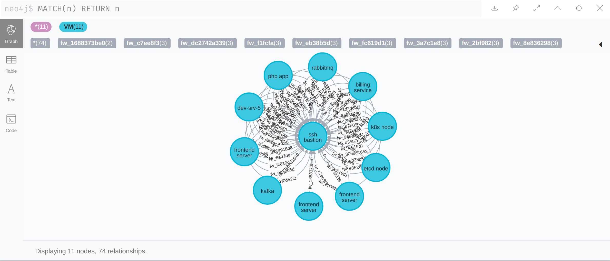

# Attack predictor
    

## 🔧 Usage

### Load configuration

Install dependencies:
```bash
cd loader
python3.7 -m pip install -r requirements.txt
```

Load configuration:
```bash
python3.7 load.py my-network-config.json
```

Clean and load:
```bash
python3.7 load.py my-network-config.json
```

You could see the result on [localhost:7474](http://localhost:7474)



### Start backend

```bash
cd backend
docker-compose build
bocker-compose up
```

Use:
- GET [localhost:5000/attack?vm_id=](http://localhost:5000/attack?vm_id=)
- GET [localhost:5000/stats](http://localhost:5000/stats)

## ❓ Decision reasons

* **Why Neo4j?**  
  Powerful relationships: one/two way, with additional info, could be queried  
  Built-in GUI that 100% fits our needs  
* **Why key-value storage (redis) instead of life-time variable?**  
  Because if we would like to scale our backends to e.g. 3 nodes - every instance would have their own stats. That's not what we want. As so - we need to have the ability to access this stats data from other machines
* **Why redis and not other key-value storage?**  
  Because redis is the simplest solution. It has some drawbacks: single-thread (=> problems from 10K parallel clients), not machine fail tolerant. Both of them are not related to our problem (it's very improbable that /stats endpoint would have 10K instances; we start counting from backend process start, not from the first start - as so, we don't care much about fail tolerance) 
* **Why Flask?**  
  We have 2 routs, no canonical database integration, no async tasks, no management commands => django is an overhead.  
  Our operations are sync => no need to use async frameworks like Twisted
  => Flask
* **Does it scale?**  
  Yes, we can spawn as many backend instances as we want. Neo4j supports [sharding](https://neo4j.com/developer/neo4j-fabric-sharding/). So, no problems out of the box
* **What could be done better?**  
  Additional logging, sentry integration, monitoring
